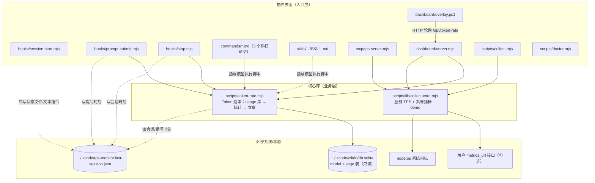

# zcode-tps-monitor — 项目架构报告

**分析时间**：2026-09-29_164007
**分析范围**：`D:\Guiyuan1111\GitHub\zcode-tps-monitor`
**分析模式**：完整分析

---

## 1. 技术栈全景

### 编程语言

| 语言 | 文件数 | 行数 | 主要用途 |
|------|--------|------|---------|
| JavaScript (ESM/.mjs) | 11 | ~1,538 | 全部运行时逻辑：钩子、CLI、MCP、大屏服务、图标生成、测试 |
| PowerShell | 1 | 225 | Windows 桌面悬浮条（WPF + Win32 P/Invoke） |
| HTML/CSS/JS（单文件内嵌） | 1 | 269 | 监控大屏前端（原生 Canvas 绘图，无框架） |
| Markdown | 8 | — | 命令 prompt、技能定义、双 README、CHANGELOG、CI 说明载体 |
| JSON | 5 | — | 市场清单、双插件清单、MCP 注册、钩子注册 |

### 框架与运行时

| 技术 | 版本约束 | 用途 | 证据 |
|------|---------|------|------|
| Node.js | ≥ 22.5 | 唯一运行时 | `README.md:74`（需内置 `node:sqlite`）；CI 矩阵 22/24，`.github/workflows/ci.yml:13` |
| `node:sqlite`（DatabaseSync） | 内置 | 只读访问 ZCode usage 库 | `scripts/token-rate.mjs:20`、`scripts/doctor.mjs:53` |
| `node:http` | 内置 | 大屏 HTTP 服务 | `dashboard/server.mjs:6` |
| 全局 `fetch` + AbortController | Node ≥ 18 | 业务 TPS 远程采集 | `scripts/lib/collect-core.mjs:54-62` |
| WPF / Win32 | Windows 内置 | 悬浮条窗口 | `dashboard/overlay.ps1:7-19` |

### 构建与工具链

- **构建工具：无**——仓库没有 `package.json`，零依赖、零构建、零转译，所有 `.mjs` 直接由 `node` 执行。
- **包管理器：无**（无 node_modules）。
- **测试**：Node 内置 test runner（`node --test`，`test/token-rate.test.mjs:1`）。
- **代码检查/格式化：未配置**。

### 外部服务与基础设施

| 服务 | 集成方式 | 代码位置 |
|------|---------|---------|
| ZCode usage SQLite 库 | 只读 SQL（`model_usage` 表） | `scripts/token-rate.mjs:50-84` |
| 任意 JSON 指标接口（用户自配） | HTTP GET + 宽松字段匹配 | `scripts/lib/collect-core.mjs:54-74` |
| jsDelivr CDN（gcore 节点） | 市场图标 URL | `marketplace.json:16` |
| GitHub Actions | CI 矩阵 | `.github/workflows/ci.yml` |

> 显著的**负空间**：无数据库写入、无网络监听持久服务（大屏仅 127.0.0.1 且空闲自退）、无第三方 npm 包。插件对宿主环境的全部持久化都收敛在用户家目录的 3 个文件（见运行原理报告 §3）。

---

## 2. 目录结构与功能角色

```
zcode-tps-monitor/                          # 仓库根 = 本地插件市场 [分发层]
├── marketplace.json                        #   市场清单（插件列表/版本/图标）
├── README.md / CHANGELOG.md / LICENSE      #   项目主页 / 版本史 / MIT
├── assets/                                 #   [构建辅助] 图标生成脚本 + 产物
│   ├── generate-icon.mjs                   #     纯 Node SDF 渲染 → PNG（无依赖）
│   └── icon.png                            #     256×256 产物
├── test/token-rate.test.mjs                #   [测试] 13 个 node:test 用例
├── .github/workflows/ci.yml                #   [CI/CD] 3 OS × 2 Node 矩阵
└── plugins/zcode-tps-monitor/              # 插件本体 [扩展层]
    ├── .zcode-plugin/plugin.json           #   插件清单（name/version/userConfig）
    ├── .claude-plugin/plugin.json          #   兼容清单（另一客户端生态）
    ├── .mcp.json                           #   [外部接口] MCP server 注册（stdio）
    ├── hooks/                              #   [事件入口] 生命周期钩子
    │   ├── hooks.json                      #     注册表：SessionStart/UserPromptSubmit/Stop
    │   ├── session-start.mjs               #     会话启动：记状态 + 注入提示
    │   ├── prompt-submit.mjs               #     每轮提问：记时刻 + 注入指令（中枢）
    │   └── stop.mjs                        #     回复结束（兼容保留，客户端暂不触发）
    ├── commands/                           #   [表现层] 斜杠命令（自然语言 prompt）
    │   ├── tps.md / tps-doctor.md / dashboard.md
    ├── skills/zcode-tps-monitor/SKILL.md   #   [表现层] 自动触发技能（关键词路由）
    ├── mcp/tps-server.mjs                  #   [外部接口] stdio MCP server（2 个工具）
    ├── dashboard/                          #   [表现层] 监控大屏
    │   ├── server.mjs                      #     HTTP 服务（页面 + 2 个 API）
    │   ├── index.html                      #     深色面板（Canvas 速率曲线）
    │   └── overlay.ps1                     #     Windows 悬浮条（独立客户端）
    ├── scripts/                            #   [业务层 + 数据层]
    │   ├── token-rate.mjs                  #     ★ Token 速率核心（统计 + 格式化 + CLI）
    │   ├── lib/collect-core.mjs            #     ★ 业务 TPS/系统指标核心（CLI/MCP/大屏共用）
    │   ├── collect.mjs                     #     业务 TPS CLI 入口（薄壳）
    │   └── doctor.mjs                      #     自检（5 项检查）
    └── docs/effect-token-rate.png          #   效果截图
```

### 目录角色标注说明

- **[分发层]**（仓库根）——市场清单驱动 ZCode「发现/安装」；仓库本身就是市场。
- **[扩展层]**（plugins/）——插件的 5 类「表面」共用同一组核心库：**钩子**（被动触发）、**命令**（用户显式触发）、**技能**（语义自动触发）、**MCP**（程序化触发）、**大屏**（独立进程触发）。
- **[业务层/数据层]**（scripts/）——两个核心库是仅有的复用单元，其余文件都是「入口薄壳」。

---

## 3. 模块依赖关系

### 核心依赖图



### 模块间依赖分析

| 源模块 | 目标模块 | 依赖类型 | 关键代码 |
|--------|---------|---------|---------|
| `hooks/prompt-submit.mjs` | `scripts/token-rate.mjs` | ESM 具名导入（`query`, `formatLine`） | `prompt-submit.mjs:15` |
| `hooks/stop.mjs` | `scripts/token-rate.mjs` | ESM 具名导入（`queryTurn`, `formatTurnLine`） | `stop.mjs:10` |
| `dashboard/server.mjs` | `token-rate.mjs` + `collect-core.mjs` | 双核心都要（`/api/token-rate` 与 `/api/metrics`） | `server.mjs:11-12` |
| `mcp/tps-server.mjs` | `collect-core.mjs` | 4 个具名导入 | `tps-server.mjs:14` |
| `scripts/collect.mjs` | `collect-core.mjs` | 薄壳 CLI | `collect.mjs:8` |
| `commands/tps.md`、`SKILL.md` | 脚本文件 | **非代码依赖**：自然语言指导模型 `node` 执行相对路径脚本 | `commands/tps.md:11-14`、`SKILL.md:15-26` |
| `overlay.ps1` | `server.mjs` | HTTP 轮询（进程间） | `overlay.ps1:27,174` |
| `hooks/session-start.mjs` | `token-rate.mjs` | **仅字符串引用**：把脚本绝对路径拼进注入文案，代码上零依赖 | `session-start.mjs:12,31` |

要点：

- 依赖方向严格单向（表面 → 核心库 → 外部系统），**无循环依赖**。
- `token-rate.mjs` 同时是「被导入的库」和「被模型/用户直接执行的 CLI」——靠 `process.argv[1].endsWith("token-rate.mjs")` 守卫 CLI 块（`token-rate.mjs:268`），导入时不执行副作用（除模块级路径常量求值）。
- 命令与技能对脚本的关系是**提示词级依赖**而非代码依赖，这是本插件最特别的耦合形态：文案改了路径或参数，功能即断（v0.8.3 整版修复正源于此）。

---

## 4. 架构模式识别

### 模式 1：微内核 + 多表面适配（插件式六边形）

- **判断依据**：两个核心库（`token-rate.mjs`、`collect-core.mjs`）不感知任何入口；6 种入口（3 钩子、3 命令、1 技能、MCP、大屏 HTTP、悬浮条）全部是薄适配层。`collect-core.mjs:1-2` 注释直接言明「CLI 与 MCP server 共用」。
- **表现位置**：`scripts/lib/`、各表面目录。
- **特征**：新增一个表面（如未来加 WebSocket 推送）只需新写适配层，不动统计逻辑。

### 模式 2：事件驱动（宿主钩子 + 模型收尾指令）

- **判断依据**：`hooks/hooks.json:3-50` 注册 SessionStart/UserPromptSubmit/Stop 三事件；UserPromptSubmit 注入的不是数据本身而是「让模型在收尾时自测」的指令（`prompt-submit.mjs:35-41`），把模型的工具调用流当作可编程的事件管道。
- **表现位置**：`hooks/`、`README.md:94-111` 的流程图。
- **特征**：插件把「AI 模型」本身当成编排组件——这是整个项目最有辨识度的架构决策。

### 模式 3：状态文件总线（跨进程协调）

- **判断依据**：钩子进程、模型 CLI 进程、大屏进程、doctor 进程互相不认识，全部通过 `~/.zcode/tps-monitor.last-session.json` 的 `{sessionId, ts, source}` 三元组协调（写方：`session-start.mjs:19-22`、`prompt-submit.mjs:23-28`、`stop.mjs:41-49`；读方：`token-rate.mjs:40-48`、`server.mjs:17-25`）。
- **特征**：7 天 TTL 防陈旧（`token-rate.mjs:38`）；`source` 字段自带溯源。

### 模式 4：优雅降级链

- **判断依据**：每个环节都有明确的下一级回退——远程接口失败回退 demo（`collect-core.mjs:121-127`）；旧库无 `turn_id` 列回退单段口径（`token-rate.mjs:152-161` 的 try/catch）；无会话时状态文件 → 全局最近（`token-rate.mjs:56-63`）；`main_turn` 无数据回退全部请求（`token-rate.mjs:71-84`）。
- **特征**：降级永不抛错到用户脸上。

---

## 5. 关键设计模式实例

| 模式 | 位置 | 代码形态 |
|------|------|---------|
| 共享内核库 | `scripts/lib/collect-core.mjs:114-167` | `snapshot()`/`watch()` 纯异步函数，env 参数可注入（`snapshot(env = process.env)`）便于测试 |
| 守卫子句 | `scripts/token-rate.mjs:187-195` | `--current` 守卫：`if (ts && lastAt < ts) return { noCurrentTurnData: true }` |
| 策略选择 | `scripts/token-rate.mjs:56-68` | 会话解析三级策略（显式 → 状态文件 → 全局最近） |
| 单例约定 | `dashboard/server.mjs:38-51` | PID 文件即跨进程单例锁（写入时校验属主再删） |
| 重试 + 轮询 | `hooks/stop.mjs:69-73` | 5 × 250ms 短重试等待写库竞态收敛 |
| 帧解析状态机 | `mcp/tps-server.mjs:119-150` | Buffer 累积 + Content-Length 切帧，兼容裸 JSON 行 |
| 依赖注入（轻量） | `collect-core.mjs:12,114,132` | 所有导出函数接受 `env` 参数默认 `process.env` |

---

## 6. 函数级清单与调用链

### 6a. `scripts/token-rate.mjs`（293 行，中枢模块）

| 函数 | 签名 | 位置 | 职责 |
|------|------|------|------|
| `readState` | `() => {sessionId, ts, source} \| null` | `token-rate.mjs:40` | 读状态文件，TTL 7 天 |
| `openDb` | `() => DatabaseSync` | `token-rate.mjs:50` | 只读打开 usage 库 |
| `fallbackSessionId` | `(db) => string \| null` | `token-rate.mjs:56` | 状态文件 → 全局最近完成请求 |
| `resolveSession` | `(db, sessionId) => {sid, scoped}` | `token-rate.mjs:65` | 会话解析结果封装 |
| `scopeFor` | `(db, sid) => {scopeSql, args}` | `token-rate.mjs:71` | main_turn 优先的 SQL 范围构建 |
| `toItem` | `(row) => Item` | `token-rate.mjs:86` | 行 → 统计项（速率换算 + 有效性判定） |
| `sessionAggregate` | `(db, scopeSql, args, rated) => Agg \| null` | `token-rate.mjs:109` | 窗口均/峰 + 全会话独立 SUM |
| `query` | `(sessionId) => Result` | `token-rate.mjs:130` | 「最近一次 + 会话统计」查询（导出） |
| `latestTurnId` | `(db, sid) => string \| null` | `token-rate.mjs:152` | 最新 turn_id（旧库 catch → null） |
| `lastPromptTs` | `() => number \| null` | `token-rate.mjs:165` | 提问时刻（守卫基准） |
| `queryTurn` | `(sessionId, opts) => TurnResult` | `token-rate.mjs:170` | 「本问」轮次统计（导出，含守卫） |
| `fmtCompact` | `(n) => string` | `token-rate.mjs:220` | 紧凑单位（导出） |
| `fmtNum` | `(n) => string` | `token-rate.mjs:228` | 千分位（导出） |
| `formatLine` | `(r) => string` | `token-rate.mjs:232` | 「上轮」行文案（导出） |
| `formatTurnLine` | `(r) => string` | `token-rate.mjs:251` | 「本轮」行文案（导出） |

### 6b. `scripts/lib/collect-core.mjs`（200 行）

| 函数 | 签名 | 位置 | 职责 |
|------|------|------|------|
| `resolveUrl` | `(env) => string \| null` | `collect-core.mjs:12` | 解析 TPS_URL，`${...}` 占位符视为未配置 |
| `demoStep` | `() => Metrics`（内部） | `collect-core.mjs:23` | 随机游走演示数据（clamp 边界 240-1560/6-40/0.01-2.5） |
| `deepFind` | `(obj, keys, depth) => number \| undefined`（内部） | `collect-core.mjs:42` | 3 层深度宽松字段匹配 |
| `fetchRemoteMetrics` | `(url, timeoutMs) => Metrics` | `collect-core.mjs:54` | AbortController 超时抓取 + 字段映射 |
| `sampleCpuPercent` | `(intervalMs) => number \| null` | `collect-core.mjs:87` | CPU 时间差采样（Windows loadavg 恒 0 的替代） |
| `systemMetrics` | `() => SystemMetrics`（内部） | `collect-core.mjs:96` | os 模块聚合 |
| `snapshot` | `(env) => Snapshot` | `collect-core.mjs:114` | 单次快照（remote→demo 降级） |
| `watch` | `(seconds, env) => WatchReport` | `collect-core.mjs:132` | 2-60s 逐秒采样 + 统计 |
| `formatSnapshot` / `formatWatch` | `(s/w) => string` | `collect-core.mjs:173,188` | 人类可读文案 |

### 6c. 调用链 1：每轮提问（UserPromptSubmit）

```
ZCode 触发 UserPromptSubmit 事件
 └─ hooks/prompt-submit.mjs（顶层内联）
     ├─ noteSession: writeFileSync(~/.zcode/tps-monitor.last-session.json)   [prompt-submit.mjs:21-30]
     ├─ readConfig: JSON.parse(~/.zcode/tps-monitor.config.json)             [prompt-submit.mjs:43-51]
     ├─ query(sid)                                                           [token-rate.mjs:130]
     │   ├─ openDb → new DatabaseSync(DB_PATH, {readOnly:true})              [token-rate.mjs:50-52]
     │   ├─ resolveSession → fallbackSessionId → readState                   [token-rate.mjs:56-68]
     │   ├─ scopeFor（main_turn 优先，含 LIMIT 1 探测）                       [token-rate.mjs:71-84]
     │   ├─ SQL: 取 HIST=60 条 → slice(0,N=5) → toItem × 5                   [token-rate.mjs:136-138]
     │   └─ sessionAggregate（SUM 累计 + 窗口均/峰）                          [token-rate.mjs:109-128]
     ├─ formatLine(r)                                                        [token-rate.mjs:232-248]
     └─ emit(additionalContext)                                              [prompt-submit.mjs:53-57]
         └─ "【内部背景·勿展示】上一条回复:" + line + TURN_STATS_INSTRUCTION  [prompt-submit.mjs:65]
```

### 6d. 调用链 2：收尾自测（模型执行 CLI，★核心链路）

```
模型在回复收尾（本回答已调用过工具时）
 └─ node token-rate.mjs --turn --current                    [CLI 守卫 token-rate.mjs:268-291]
     └─ queryTurn(sid, {current})                           [token-rate.mjs:170-217]
         ├─ resolveSession → fallbackSessionId → readState  [token-rate.mjs:173]
         ├─ scopeFor + sessionAggregate（全会话口径）        [token-rate.mjs:175-177]
         ├─ latestTurnId（旧库无列 catch → null 降级）       [token-rate.mjs:152-161,178-179]
         ├─ SQL: scopeSql + AND turn_id=? ORDER BY completed_at ASC  [token-rate.mjs:182]
         ├─ --current 守卫                                   [token-rate.mjs:187-195]
         │   └─ max(行 completed_at) < lastPromptTs() → 返回 noCurrentTurnData（CLI 静默）
         ├─ toItem × N → rated 过滤                          [token-rate.mjs:196-197]
         └─ turn 聚合                                        [token-rate.mjs:198-212]
             ├─ tokPerSec = Σ(output+reasoning) / Σ(genMs)   （加权，排除段间工具等待）
             ├─ peak = max(各段 tokPerSec)
             └─ ttftMs = items[0].ttftMs                     （本轮第一段）
     └─ formatTurnLine(r) → console.log（仅 r.turn 存在时）  [token-rate.mjs:251-265, 276-277]
```

### 6e. 调用链 3：大屏（浏览器每秒轮询）

```
浏览器 index.html
 ├─ setInterval(tickTok, 1000)                      [index.html:265]
 │   └─ GET /api/token-rate                        [server.mjs:75-91]
 │       ├─ followedSessionId()（状态文件 + 7 天 TTL）[server.mjs:17-25]
 │       ├─ tokenRateQuery(id) = query()            [server.mjs:12 导入]
 │       └─ tokenRateTurnQuery(id).turn（进行中本问） [server.mjs:81-83]
 └─ setInterval(tickSys, 2000)                      [index.html:266]
     └─ GET /api/metrics                           [server.mjs:64-74]
         └─ snapshot()                              [collect-core.mjs:114-130]
             ├─ resolveUrl(env.TPS_URL)
             ├─ fetchRemoteMetrics(url) [remote] / demoStep() [demo/降级]
             └─ systemMetrics() → sampleCpuPercent(250ms)
```

### 6f. 调用链 4：MCP（stdio JSON-RPC）

```
ZCode 客户端 ←→ .mcp.json 注册（node mcp/tps-server.mjs，TPS_URL 注入自 user_config）
 └─ tps-server.mjs
     ├─ stdin 'data' → buffer 切帧（Content-Length 头 或 裸 JSON 行）→ handleRaw → handleRequest  [tps-server.mjs:119-150]
     ├─ initialize / ping / tools/list                                          [tps-server.mjs:63-75]
     └─ tools/call
         ├─ tps_snapshot → snapshot() → formatSnapshot → ok(...)               [tps-server.mjs:80-82]
         └─ tps_watch(sec)（clamp 2-30）→ watch(sec) → formatWatch → ok(...)   [tps-server.mjs:83-86]
```

### 6g. 调用链 5：doctor 自检

```
/tps-doctor 命令（commands/tps-doctor.md 指导模型）
 └─ node scripts/doctor.mjs → runDoctor()                            [doctor.mjs:150-158]
     ├─ nodeVersionCheck（≥ 22.5）                                   [doctor.mjs:30-39]
     ├─ dbCheck：PRAGMA table_info(model_usage) → REQUIRED_COLS diff [doctor.mjs:41-89]
     ├─ stateFileCheck：ts 存在性（--current 守卫依据）               [doctor.mjs:91-113]
     ├─ configCheck：tokenRateLine / stopHookLine(废弃提示)           [doctor.mjs:115-132]
     └─ dashboardCheck：PID 文件 → process.kill(pid, 0) 探活          [doctor.mjs:134-148]
```

### 6h. 异步/并发点标注

| 位置 | 并发形态 | 控制方式 |
|------|---------|---------|
| `stop.mjs:69-73` | 写库竞态 | 5 次定长轮询 × 250ms |
| `collect-core.mjs:54-62` | 网络超时 | AbortController + setTimeout(5000/3000) |
| `server.mjs:108-118` | 空闲自退 | setInterval 巡检（阈值/2 间隔，clamp 1-60s）+ `unref()` |
| `overlay.ps1:145-183` | UI 定时器 | WPF DispatcherTimer 1s；每 5 tick 采样主题 |
| `token-rate.mjs:130-146` | 无 | 同步 SQLite（DatabaseSync），毫秒级完成 |

---

## 7. 架构健康度评估

| 维度 | 评分（1-5） | 说明 |
|------|------------|------|
| 模块化程度 | 5 | 表面/核心分层彻底，两个核心库零相互依赖，薄壳入口平均 <120 行 |
| 依赖管理 | 5 | 零第三方依赖，无供应链风险；代价见「技术债务」 |
| 可测试性 | 4 | env 参数可注入 + 状态文件路径可覆盖（`TPS_MONITOR_STATE_FILE`），`test/token-rate.test.mjs` 已示范；扣 1 分：`collect-core.mjs` 与 MCP 层无测试 |
| 文档一致性 | 4 | 双 README + CHANGELOG + SKILL 交叉印证，v0.8.3 后口径统一；命令/技能里的相对路径说明（`../../scripts/...`）较绕 |
| 错误处理 | 5 | 全链路 try/catch 静默降级，钩子永不阻塞对话，doctor 提供可观测出口 |
| 技术债务 | 3 | ① 手写 MCP 帧解析与 PNG CRC32 等底层代码无测试兜底；② 版本号散布 4 处需手工同步；③ `overlay.ps1` 仅 Windows 且无任何自动化验证；④ 无 lint/format 配置，风格靠自律 |
