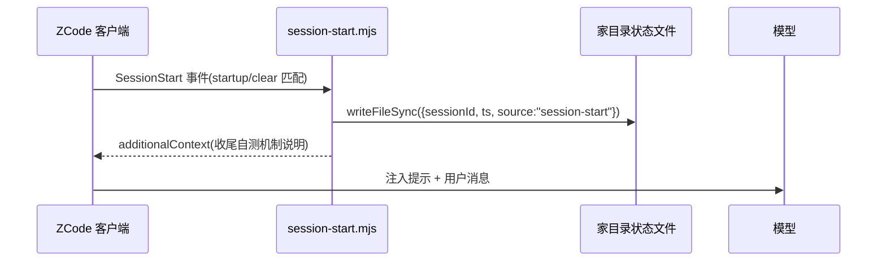
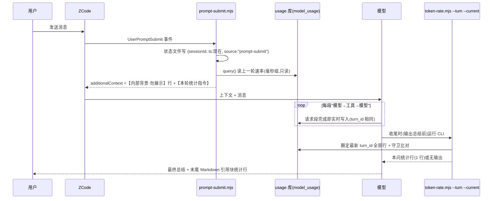
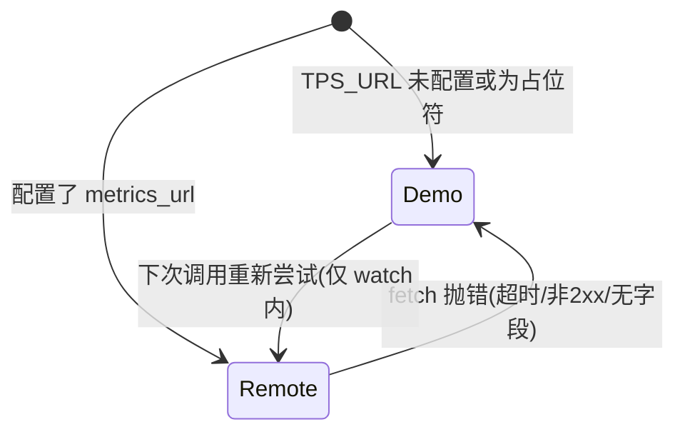

# zcode-tps-monitor — 项目运行原理报告

**分析时间**：2026-09-29_164007
**分析范围**：`D:\Guiyuan1111\GitHub\zcode-tps-monitor`

---

## 1. 启动初始化序列

本插件没有传统意义上的「单一 main 入口」——它有 **7 个独立入口**，各自被不同事件拉起。生命周期从「插件安装」到「会话运行」分四个阶段。

### 阶段 A：插件安装（一次性）

| 步骤 | 操作 | 代码位置 | 说明 |
|------|------|---------|------|
| 1 | ZCode 读取市场清单 | `marketplace.json` | 发现 `zcode-tps-monitor@0.8.3`，图标走 jsDelivr gcore CDN（`marketplace.json:16`，CN 可达性是 v0.8.1 期间 5 个 fix commit 的产物） |
| 2 | 读取插件清单 | `.zcode-plugin/plugin.json:20-21` | 声明 `commands`、`skills` 目录与 `userConfig.metrics_url` |
| 3 | 注册钩子 | `hooks/hooks.json:3-50` | 三事件 + 各自 timeoutMs（3000/8000/8000ms） |
| 4 | 注册 MCP | `.mcp.json:3-14` | stdio，`${ZCODE_PLUGIN_ROOT}` 展开为安装目录，`TPS_URL` 从用户配置注入 |

### 阶段 B：会话启动（每次新会话）



- 写状态文件：`hooks/session-start.mjs:15-24`（失败静默 `catch {}`）。
- 注入文案刻意**不**说「速率会自动显示」——因为当前客户端不触发 Stop 钩子，那类表述会让模型收尾时什么都不做（`session-start.mjs:27-29` 的注释明示这是 v0.8.3 修复的坑）。

### 阶段 C：每轮提问 → 回复（核心循环）



### 阶段 D：回复结束（Stop 钩子，兼容保留）

`hooks/stop.mjs` 设计为回复刚结束时经 `systemMessage` 直接显示本问速率（`stop.mjs:75`），并有 5×250ms 写库竞态重试（`stop.mjs:69-73`）。**当前客户端版本不触发该事件**（`README.md:116`），机制保留待未来启用。

### 独立入口的启动

| 入口 | 启动序列 | 关键代码 |
|------|---------|---------|
| `/tps`、`/tps-doctor`、`/dashboard` 命令 | ZCode 把 `commands/*.md` 的自然语言步骤交给模型解释执行（无代码启动） | `commands/tps.md:7-14` 等 |
| 大屏 | 读 index.html → 监听 127.0.0.1:7423 → 写 PID 文件 → 启动空闲巡检定时器 | `server.mjs:96-118` |
| 悬浮条 | WPF 窗口 → SetProcessDPIAware → 找 ZCode 主窗口句柄设为 owner → 定位/主题初始化 → 1s DispatcherTimer | `overlay.ps1:21-224` |

### 优雅关闭机制

- **大屏**：SIGINT/SIGTERM → `exit(0)`；`exit` 事件里校验 PID 属主再删文件（`server.mjs:45-54`）；空闲 180 分钟自退（`--idle-exit` 可调，0 = 关闭）。
- **悬浮条**：右键菜单「关闭监控条」唯一出口 → `DragMove` 记忆偏移（`overlay.ps1:128-132`）。
- **钩子**：全部 `catch` 后仍输出合法 JSON（`{}` 或空 additionalContext），绝不阻塞对话。

---

## 2. 核心数据流追踪

### 数据流 1：「本问」速率统计（主链路）

**触发方式**：模型收尾时执行 `node token-rate.mjs --turn --current`

**变量级数据变换**（以一次「模型→工具→模型→工具→模型」三段回复为例）：

| 步骤 | 变量 | 类型 | 值/状态变化 | 代码位置 |
|------|------|------|------------|---------|
| 入口 | `turnRows` | `Row[]` | 3 行 main_turn 记录，`turn_id` 均为 `"t_9f2"` | `token-rate.mjs:182` |
| 换算 | `items` | `Item[]` | 每行产出 `{outputTokens, reasoningTokens, genMs, tokPerSec, ttftMs...}` | `token-rate.mjs:196 → toItem:86` |
| 过滤 | `rated` | `Item[]` | 剔除 `genMs < 200ms` 或 `rateTokens = 0` 的段（如 50ms 的短段 tokPerSec=null） | `token-rate.mjs:94,197` |
| 聚合分子 | `totalTok` | `number` | `Σ(outputTokens + reasoningTokens)`，例 `80+220 = 300` | `token-rate.mjs:198` |
| 聚合分母 | `genMs` | `number` | `Σ(rated.genMs)`，例 `500+1100 = 1600`；**段间工具等待不计入** | `token-rate.mjs:199` |
| 速率 | `turn.tokPerSec` | `number` | `round(300/1600×10000)/10 = 187.5`（加权而非各段均值） | `token-rate.mjs:210` |
| 峰值 | `turn.peak` | `number` | `max(160, 200) = 200` | `token-rate.mjs:211` |
| 首字 | `turn.ttftMs` | `number` | `items[0].ttftMs = 450`（本轮第一段） | `token-rate.mjs:203` |
| 守卫 | `noCurrentTurnData` | `boolean` | `max(completed_at) < 状态文件.ts` 时为 `true` → CLI 输出空 | `token-rate.mjs:189-195` |
| 文案 | `formatTurnLine(r)` | `string` | `"⚡ 187.5 tok/s(本轮) · 首字 0.5s · 输出 320 tok / 生成 1.6s · 3 段 / 峰 200 · 累计 1.8k tok · ⏱ 10:23:04"` | `token-rate.mjs:251-265` |

**关键口径**（均可在代码定位）：

- 速率分子**含思考 token**：`rateTokens = tok + reasoning`（`token-rate.mjs:93`，注释说明思考内容同样是流式输出）。
- 有效样本边界：`MIN_GEN_MS=200`、`MAX_GEN_MS=3,600,000`（`token-rate.mjs:31-32`，可经 `TOKEN_RATE_MIN_MS/MAX_MS` 覆盖）。
- 会话累计走**独立 SUM SQL**，不受展示窗口 N=5 限制（`token-rate.mjs:109-116`）。
- 最终总结文字在最近一次工具调用之后生成，天然不计入统计（README.md:127 口径说明）。

### 数据流 2：业务 TPS 快照

**触发方式**：`/tps` 命令 → MCP `tps_snapshot` → `snapshot()`

| 阶段 | 数据结构 | 变换 | 代码位置 |
|------|---------|------|---------|
| 配置 | `TPS_URL: string` | `${user_config.metrics_url}` 未配置时原样为 `"${...}"`，`resolveUrl` 判 null | `.mcp.json:10` → `collect-core.mjs:12-17` |
| 抓取 | `Response → JSON` | AbortController 5s 超时；非 2xx 抛 `HTTP <code>` | `collect-core.mjs:54-63` |
| 映射 | `JSON → Metrics` | `deepFind` 三层深度找 `tps/qps/throughput/transactionsPerSecond`；找不到抛错 | `collect-core.mjs:38-52,65-66` |
| 降级 | `Metrics` | 抓取失败 → `demoStep()`（随机游走）+ mode 标注 `demo(接口不可用: …)` | `collect-core.mjs:121-127` |
| 附加 | `+ SystemMetrics` | 250ms CPU 时间差采样 + 内存/运行时长 | `collect-core.mjs:96-110,129` |
| 输出 | `Snapshot` | `{time, mode, tps, p50, p95, p99, errorRate, system:{...}}` | `collect-core.mjs:129` |

### 数据流 3：大屏实时轮询

- 前端 `tickTok`（1s）消费 `/api/token-rate` 的 `{latest, session, history[≤60], turn, follow}`；**history 由服务端全量下发**，刷新/重开页面曲线不丢（`index.html:223-229`，注释「数据库为准」）。
- `turn` 字段使「本问进行中」可见：usage 库按段实时入库，生成期间每秒都能看到速率爬升；前端以 `Date.now() - turn.lastAt < 120000` 判定「进行中/刚结束」（`index.html:215-217`）。
- 服务端会话跟随：`followedSessionId()` 读状态文件，切会话即跟随（`server.mjs:17-25`）。

---

## 3. 状态管理分析

### 跨进程状态（全部位于用户家目录 `~/.zcode/`）

| 状态类型 | 文件 | 写方 → 读方 | 结构 | 关键代码 |
|---------|------|------------|------|---------|
| 会话/提问时刻 | `tps-monitor.last-session.json` | 3 个钩子 → token-rate/大屏 | `{sessionId, ts, source}` | `prompt-submit.mjs:23-28`、`token-rate.mjs:35-48` |
| 用户开关 | `tps-monitor.config.json` | 用户手写 → prompt-submit/stop/doctor | `{"tokenRateLine": false}`（`stopHookLine` 已废弃） | `prompt-submit.mjs:43-51`、`doctor.mjs:115-132` |
| 大屏进程 | `tps-monitor.dashboard.pid` | 大屏 → doctor | 纯 PID 数字 | `server.mjs:38-51`、`doctor.mjs:134-148` |

状态文件 `ts` 的**双重语义**是理解守卫的关键：对大屏它是「会话新鲜度」（7 天 TTL，`server.mjs:20`）；对 `--current` 守卫它是「本问起点基准」（与 `completed_at` 同为纪元毫秒，`test/token-rate.test.mjs:37` 注释强调量纲必须一致——v0.8.3 修过一次量纲错误）。

### 进程内状态

| 位置 | 状态 | 生命周期 |
|------|------|---------|
| `collect-core.mjs:21` | `demo = {tps: 820, p50: 12.4, err: 0.12}` | 模块级单例，随机游走基线；MCP 长驻进程中跨请求延续（CLI 进程则每次重置） |
| `server.mjs:56` | `lastRequestAt` | 大屏空闲自退依据，每个 HTTP 请求刷新 |
| `tps-server.mjs:119` | `buffer` | stdio 帧解析残留缓冲 |

### 核心状态机

**1. 数据源模式**（`collect-core.mjs:114-167`）：



注意降级不对称：`snapshot()` 每次都先试 remote 再降级；`watch()` 一旦降级整轮保持 demo（`collect-core.mjs:139-150`）。

**2. 会话解析**（`token-rate.mjs:56-68`）：`显式 ZCODE_SESSION_ID` → `状态文件 sessionId` → `全局最近完成请求` → `null（空结果）`。

**3. `--current` 守卫**（`token-rate.mjs:187-195`）：`有最新 turn 且 max(completed_at) ≥ 提问 ts` → 正常输出；`全部早于 ts`（纯问答轮）→ `noCurrentTurnData`，CLI **不打印任何行**（`token-rate.mjs:277`）——「结构上杜绝显示上一轮」的实现根基。

**4. 大屏生命周期**（`server.mjs:96-118`）：`启动→写PID→服务中→(空闲>阈值 | SIGINT/SIGTERM)→删PID→退出`。

**5. 旧库兼容**（`token-rate.mjs:152-161,181-185`）：`turn_id 列查询抛错` → `turnId=null` → 退回单段口径，会话统计不受影响。

---

## 4. 数据持久化分析

### 数据库

- **类型**：SQLite（WAL 模式，宿主 ZCode 所有）
- **连接方式**：`node:sqlite` 的 `DatabaseSync`，**只读**打开（`token-rate.mjs:51`：`{readOnly: true}`）——插件对数据库零写入，所有行由 ZCode 客户端在每段模型请求完成时写入。
- **路径解析**：`ZCODE_USAGE_DB` 环境变量 → `~/.zcode/cli/db/db.sqlite`（`token-rate.mjs:26-28`，跨平台 homedir）。

### 核心数据模型：`model_usage` 表（从 `test/token-rate.test.mjs:29-32` 与 `doctor.mjs:24-28` 还原）

| 列 | 类型 | 语义 | 消费方 |
|----|------|------|--------|
| `session_id` | TEXT | 所属会话 | 会话圈定 |
| `status` | TEXT | `'completed'` 才统计 | 所有查询的 WHERE |
| `query_source` | TEXT | `'main_turn'` vs `'sub'`（子代理） | `scopeFor` 主对话优先过滤 |
| `model_id` | TEXT | 模型标识 | 大屏「模型 X」展示 |
| `output_tokens` / `reasoning_tokens` | INTEGER | 速率分子 | `toItem:88-93` |
| `input_tokens` / `cache_read_input_tokens` | INTEGER | CLI 明细展示 | `sessionAggregate` |
| `first_token_at` / `completed_at` | INTEGER（纪元毫秒） | `genMs = completed - first` | 速率分母、守卫基准 |
| `time_to_first_token_ms` | INTEGER | TTFT | 文案「首字 Ns」 |
| `turn_id` | TEXT（可空，新列） | 一次用户消息的全部请求段 | `queryTurn` 圈定本问；旧库缺失则降级 |

### 数据迁移策略

- 插件自身**不迁移**任何库；对宿主表结构变化的防御是「运行时探测 + 降级」：`doctor.mjs:64-75` 用 `PRAGMA table_info` 校验 11 个必需列，`latestTurnId` 用 try/catch 探测 `turn_id` 列。

### 其他持久化

- 演示数据不持久化（进程内随机游走）；图标产物 `assets/icon.png` 由 `generate-icon.mjs` 离线生成后入库（SDF 渲染 + 4× 超采样 + 手写 PNG/CRC32 编码，`assets/generate-icon.mjs:126-183`）。

---

## 5. 错误处理体系

### 错误类型层次（无自定义异常类，全部字符串 Error + 降级动作）

```
错误面
├── 环境错误   Node < 22.5 → doctor ❌ + hint「nvm install 22」     [doctor.mjs:30-39]
├── 数据库错误  文件不存在/非 SQLite/独占锁 → doctor ❌              [doctor.mjs:41-62]
│              表缺列 → doctor ❌「ZCode 版本变更了表结构」          [doctor.mjs:68-75]
│              turn_id 列缺失 → 静默降级单段口径                    [token-rate.mjs:158-160]
├── 状态错误   状态文件缺失/ts 缺失 → doctor ❌ + 守卫退化为放行警告 [doctor.mjs:91-113]
├── 网络错误   metrics 接口失败 → demo 降级 + mode 标注原因          [collect-core.mjs:121-127]
│              大屏拉取失败 → 前端红点 + 「连接失败,重试中…」        [index.html:230-232,180-182]
├── 协议错误   MCP 未知方法 → JSON-RPC -32601                       [tps-server.mjs:98-99]
│              MCP 工具内部失败 → isError:true 的正常响应           [tps-server.mjs:90-95]
└── 竞态错误   Stop 时本轮未入库 → 5×250ms 重试后静默退出           [stop.mjs:69-74]
```

### 错误传播机制

- **钩子层**：顶层 `try/catch` → 输出空 additionalContext 或直接 return，**永不冒泡到客户端**（`prompt-submit.mjs:59-69`、`stop.mjs:78-80` 的 `.catch(() => {}).finally(exit 0)`）。
- **CLI 层**：`collect.mjs:22-25` 打印 `[zcode-tps-monitor] 采集失败` + `exit(1)`；`doctor.mjs:172` 有 ❌ 项时 `exitCode=1`。
- **可观测出口**：用户感知到「速率行不见了」时，`/tps-doctor` 是唯一的结构化诊断面（这正是 doctor 存在的理由，`doctor.mjs:2`）。

### 关键异常处理点

| 操作 | 错误处理方式 | 恢复策略 | 代码位置 |
|------|------------|---------|---------|
| token-rate 打开库失败 | 抛给钩子顶层 catch | 本轮无注入，不影响对话 | `prompt-submit.mjs:67-69` |
| 远程 metrics 超时(5s/3s) | AbortController 中止 | demo 回退，mode 说明原因 | `collect-core.mjs:55-62` |
| Stop 写库竞态 | 定长轮询 5×250ms | 等到 `turn.rated>0` 或放弃 | `stop.mjs:69-73` |
| MCP 帧头无 Content-Length | 丢弃该头部继续 | 缓冲区前进，不崩进程 | `tps-server.mjs:135-138` |
| 大屏 PID 探活 | `process.kill(pid,0)` | 失败视为未运行 | `doctor.mjs:136-147` |
| 悬浮条拿不到 ZCode 窗口 | 每秒重找进程 | `catch` 显示「连接失败,重试中…」 | `overlay.ps1:135-142,180-182` |

---

## 6. 并发与异步处理

- **并发模型**：全部 async/await + 事件回调；SQLite 用同步 API（`DatabaseSync`），因查询毫秒级且钩子有 3-8s timeoutMs 预算，不构成瓶颈。
- **异步队列**：无；大屏的巡检定时器 `unref()`（`server.mjs:117`）确保不阻止进程退出。
- **竞态处理**：
  1. Stop vs 写库竞态 → 轮询重试（上述）。
  2. 大屏单例 → PID 文件属主校验删除（`server.mjs:47-48`，防误删他人 PID）。
  3. 状态文件多写方（3 钩子）→ 字段级幂等覆盖，最后写者胜，`source` 字段留痕。
- **定时任务**：大屏空闲巡检（阈值/2 间隔 clamp 1-60s，`server.mjs:109`）；悬浮条 1s 取数 + 每 5s 主题采样（`overlay.ps1:146-158`）；前端 1s/2s 双轮询（`index.html:264-266`）。
- **DPI/坐标换算**：悬浮条强制 `SetProcessDPIAware`，物理像素 ↔ WPF DIP 经实测缩放比 `S` 换算（`overlay.ps1:81-96,199-203`）——git 史上「图标缩在左上角」同类问题在 icon 脚本中也以 `S = W/256` 修过（`generate-icon.mjs:69-71`）。
