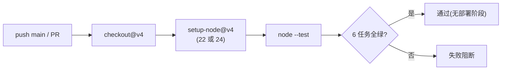
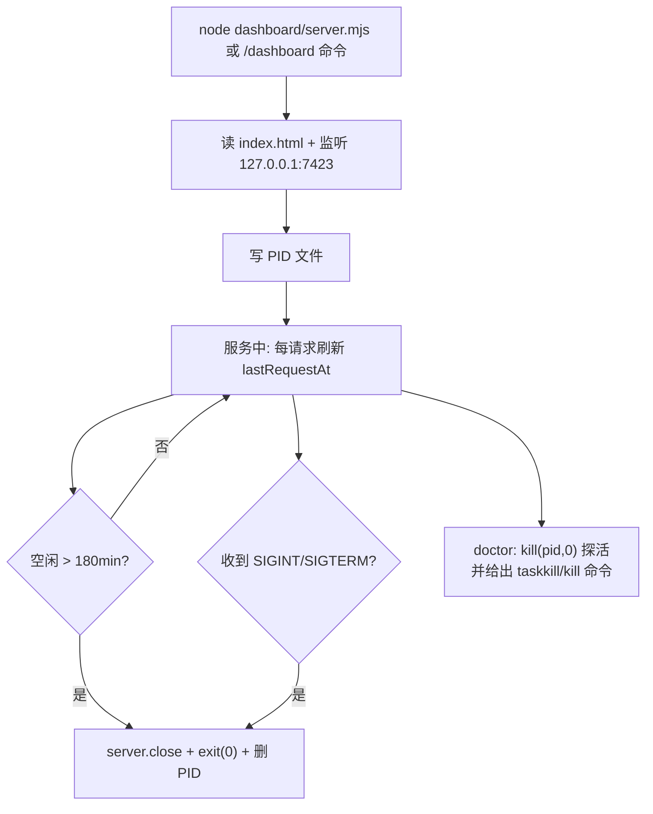

# zcode-tps-monitor — 项目工作流分析报告

**分析时间**：2026-09-29_164007
**分析范围**：`D:\Guiyuan1111\GitHub\zcode-tps-monitor`

---

## 1. CI/CD 管线

**状态**：已配置（仅 CI，无 CD——插件的「部署」是用户侧 `/plugin update`，无自动发布流水线）

### 管线概览

- **CI 工具**：GitHub Actions
- **配置文件**：`.github/workflows/ci.yml`
- **触发条件**：
  - `push` 到 `main` 分支（`.github/workflows/ci.yml:4-5`）
  - 所有 `pull_request`（`.github/workflows/ci.yml:6`）

### 管线阶段



| 阶段 | 运行内容 | 矩阵 | 配置位置 |
|------|---------|------|---------|
| Test | `node --test`（13 个用例） | 3 OS（ubuntu/windows/macos）× 2 Node（22/24）= 6 任务，`fail-fast: false` | `ci.yml:9-22` |

要点：矩阵覆盖 Windows/macOS/Linux 正对应插件「跨平台 homedir 路径解析」的承诺（`README.md:137-139`）；Windows 任务是 doctor HOME/USERPROFILE 夹具隔离修复的验收者（`test/token-rate.test.mjs:183-189`，commit `84edcd7`）。

### 部署策略（人工流程）

发布 = push 到 main + 用户侧执行 `/plugin marketplace update tps-local-marketplace`（`README.md:54-60`）。无自动 tag/Release 流水线（`.github/` 下仅 ci.yml）；但仓库 CHANGELOG 与语义化版本纪律完整，具备接入 gh Release 自动化的条件（见 AI 替代报告 blueprint 02）。

---

## 2. 测试策略

### 测试全景

| 测试类型 | 框架 | 文件数 | 位置 | 覆盖目标 |
|---------|------|--------|------|---------|
| 单元/集成（夹具库） | `node:test` + `assert/strict` | 1（13 个 test） | `test/token-rate.test.mjs` | `token-rate.mjs` 全部导出 + `doctor.mjs#runDoctor` |

### 测试配置

- 无独立配置文件（`node --test` 零配置发现 `test/`）。
- **夹具策略**：临时目录创建真实 SQLite（`fs.mkdtempSync`，`test/token-rate.test.mjs:16`），导入被测模块**之前**设置 `ZCODE_USAGE_DB`/`TPS_MONITOR_STATE_FILE`/窗口环境变量——利用模块级路径求值的时序（`token-rate.mjs` 在模块加载时读 env，`test:15` 注释明示该约束）；旧库兼容用例以 `?legacy` 查询串强制重导入新实例（`test:167`）。

### 用例清单（13 个）

| # | 用例 | 验证点 | 位置 |
|---|------|--------|------|
| 1 | fmtCompact 分档 | 7 档紧凑单位边界（999/1.6k/9.8k/51k/129k/73.8M/2.0M） | `test:54-62` |
| 2 | fmtNum 千分位 | `2,762` / `128,643` / `275` | `test:64-68` |
| 3 | 速率含思考 token | `(500+100)/1s = 600` | `test:70-75` |
| 4 | 头条取最近有效样本 | 排除 sub 行与 gen<MIN 行 | `test:77-83` |
| 5 | 窗口统计与独立 SUM | avg=315、累计含无效速率行 | `test:85-93` |
| 6 | formatLine 文案 | `(上轮)` 标注、近 N 次、累计 | `test:95-100` |
| 7 | turn 圈定与加权速率 | `t_new` 3 段 → 187.5（非均值） | `test:102-113` |
| 8 | formatTurnLine 文案 | `(本轮)`、段/峰、首字 | `test:115-122` |
| 9 | `--current` 守卫阻断 | 提问时刻晚于全部数据 → noCurrentTurnData | `test:124-133` |
| 10 | `--current` 守卫放行 | 本问已有数据 → 正常返回 | `test:135-143` |
| 11 | 状态文件会话优先 | 而非全局最近完成请求 | `test:145-153` |
| 12 | 旧库无 turn_id 优雅降级 | turnId=null 但会话统计完好 | `test:155-175` |
| 13 | doctor 夹具全绿 | HOME/USERPROFILE 隔离后 0 失败 | `test:178-200` |

### 测试健康度

| 维度 | 评估 | 证据 |
|------|------|------|
| 覆盖率 | **中**——旗舰路径（守卫/加权/降级）全覆盖，但 `collect-core.mjs`（demo/deepFind/watch/降级）、MCP 帧解析、`server.mjs` HTTP 层、3 个钩子的 JSON 输出格式**零测试** | `test/` 仅 1 文件 |
| 测试质量 | 良好——注释解释每个断言的数值来源，夹具与真实量纲一致（纪元毫秒） | `test:36-44` |
| 缺失区域 | MCP `Content-Length` 切帧边界（半包/粘包）、`resolveUrl` 占位符逻辑、`fmtSnapshot` 文案 | — |
| CI 集成 | 每次推送 + PR 自动运行 | `ci.yml:21-22` |

---

## 3. 核心业务流程映射

本插件的「业务」是监控本身。5 个核心业务流程按使用频率排列：

### 流程 1：每轮「本问」速率统计（最高频，每条工具回复一次）

**涉及模块**：`hooks/prompt-submit.mjs`、`scripts/token-rate.mjs`、usage 库、模型
**触发条件**：用户每发一条消息
**参与角色**：用户、ZCode 客户端、钩子进程、模型、usage 库

**决策树**（`prompt-submit.mjs:59-69` → `token-rate.mjs:268-291`）：

```
用户发送消息
├── 钩子: config.tokenRateLine === false?            [prompt-submit.mjs:61]
│   ├── 是 → 注入空串,结束(总开关关闭)
│   └── 否 → 注入【内部背景】上一轮行 + 【本轮统计指令】
        └── 模型回复过程中
            ├── 本回答调用了工具?                       [指令文本要求, prompt-submit.mjs:40]
            │   ├── 否(纯问答) → 收尾不运行脚本,不显示任何统计行
            │   └── 是 → 收尾时运行 token-rate.mjs --turn --current
            │       ├── 库里能找到 turn_id?              [token-rate.mjs:152-161]
            │       │   └── 否(旧库) → 无本轮数据,静默
            │       ├── --current 守卫: max(completed_at) < 提问 ts?  [token-rate.mjs:189-195]
            │       │   └── 是 → 输出空(绝不显示上一轮)
            │       ├── 有效段 ≥ 1 且 ΣgenMs ≥ 200ms?    [token-rate.mjs:210]
            │       │   └── 否 → tokPerSec=null,行内显示 "-"
            │       └── 输出 1 行 → 模型放入 Markdown 引用块贴回复末尾
```

**量化业务规则**（硬编码常量）：

| 常量 | 值 | 含义 | 位置 |
|------|-----|------|------|
| `MIN_GEN_MS` | 200 | 有效样本最短生成耗时 | `token-rate.mjs:31` |
| `MAX_GEN_MS` | 3,600,000 | 有效样本最长生成耗时（1h） | `token-rate.mjs:32` |
| `N` | 5 | 展示窗口（近 N 次均/峰） | `token-rate.mjs:29` |
| `HIST` | 60 | 大屏曲线历史点数 | `token-rate.mjs:30` |
| `STATE_TTL_MS` | 7 天 | 状态文件有效期 | `token-rate.mjs:38` |
| 钩子 timeout | 3000/8000/8000 | 三事件的毫秒预算 | `hooks.json:14,29,44` |

**异常恢复路径**：

| 流程步骤 | 可能失败点 | 异常处理方式 | 恢复策略 | 代码位置 |
|---------|-----------|------------|---------|---------|
| 钩子查询库 | 库被锁/不存在 | 顶层 catch → 注入空 | 本轮无统计，对话不受影响 | `prompt-submit.mjs:67-69` |
| 模型收尾自测 | 模型忽略指令 | 无技术兜底（依赖文案质量） | /tps 与大屏仍可手动查看 | v0.8.3 全部文案对齐即为此 |
| 输出统计行 | 本轮无有效段 | tokPerSec 显示 "-" | 不阻断其余字段 | `token-rate.mjs:257` |

### 流程 2：监控大屏生命周期

**涉及模块**：`dashboard/server.mjs`、`index.html`、（可选）`overlay.ps1`、doctor 探活



关键代码：`server.mjs:96-118`（启动/自退）、`server.mjs:45-54`（PID 属主校验清理）、`doctor.mjs:134-148`（探活 + 平台相关停止命令）。

### 流程 3：doctor 诊断（「速率行不见了」排障）

**决策树**（`doctor.mjs:41-148` 五项检查的判定链）：

```
/tps-doctor
├── Node ≥ 22.5?                       ❌ → "nvm install 22 / 官网 LTS"        [doctor.mjs:30-39]
├── usage 库存在且可只读打开?            ❌ → "设 ZCODE_USAGE_DB 指向 db.sqlite"   [doctor.mjs:42-62]
│   └── model_usage 表 11 列齐全?       ❌ → "ZCode 版本变更表结构,升级插件/反馈"  [doctor.mjs:64-75]
├── 状态文件存在且含 ts?                ❌(缺 ts) → "旧版钩子写入;重发消息重写"    [doctor.mjs:91-113]
├── 配置文件可解析?                     tokenRateLine=false → "属预期"           [doctor.mjs:115-132]
│                                      stopHookLine 存在 → "已废弃,可删除"
├── 大屏 PID 探活成功?                  成功 → 附停止命令                        [doctor.mjs:134-148]
└── 汇总: failed>0 → exitCode 1
```

设计意图：把「最常见四类故障」（Node 版本、表结构漂移、状态文件过旧、用户自己关了）做成**自服务排障**，降低 issue 量（`README.md:133-135` FAQ 与之一一对应）。

### 流程 4：MCP 程序化取数

`initialize` → `tools/list`（2 工具）→ `tools/call`。输入校验极简：`tps_watch` 秒数 clamp 2-30（`tps-server.mjs:84`）；工具内部异常转 `isError: true` 正常响应而非协议错误（`tps-server.mjs:90-95`）——保证 agent 侧拿到可读错误文本。

### 流程 5：业务 TPS 接入（低频，配置一次）

用户在 设置 → 插件管理 配置 `metrics_url` → ZCode 把值注入 `TPS_URL` → `resolveUrl` 过滤 `${...}` 占位符（未配置态）→ `deepFind` 三层深度匹配 `tps/qps/throughput/transactionsPerSecond` 等字段（`collect-core.mjs:38-52`）→ 失败自动回 demo 并在 mode 字段说明原因。

---

## 4. 开发与发布工作流

### 分支策略

- **单分支 `main` 直推**（git 史 23 个 commit 无一 PR/分支痕迹，`git branch -a` 仅 main）。
- 提交信息风格：`类型: 摘要`（`feat:`/`fix:`/`docs:`/`rename:`）或 `vX.Y.Z: 主题`，中英混用。

### 版本发布流程（从 CHANGELOG 与 git 史还原）

1. 改代码 + 补测试（`node --test` 本地验证）
2. **同步 4 处版本号**：`marketplace.json:12`、`.zcode-plugin/plugin.json:3`、`.claude-plugin/plugin.json:3`、`CHANGELOG.md` 新增条目
3. commit（如 `60c0e19 v0.8.3: ...`）→ push main → CI 6 任务
4. 用户侧 `/plugin marketplace update` 拉新（钩子需重开会话注册，`README.md:60`）

> 风险点：4 处版本号无任何一致性校验（CI 只跑测试）；MCP server 的版本号读取 `.zcode-plugin/plugin.json`（`tps-server.mjs:17-22`），漏改会造成市场显示与 MCP 握手版本不一致。

### Code Review 流程

不存在（单人项目，无 PR 模板、无 branch protection 痕迹）。

### 修改后生效链路

改代码 → 设置→插件管理 重新安装/刷新 → **重开会话**（钩子重新注册）→ 新指令注入生效（`plugins/zcode-tps-monitor/README.md:105-107`）。这条链路解释了为何 v0.8.3 的「文案修复」必须发版且用户需重开会话。
