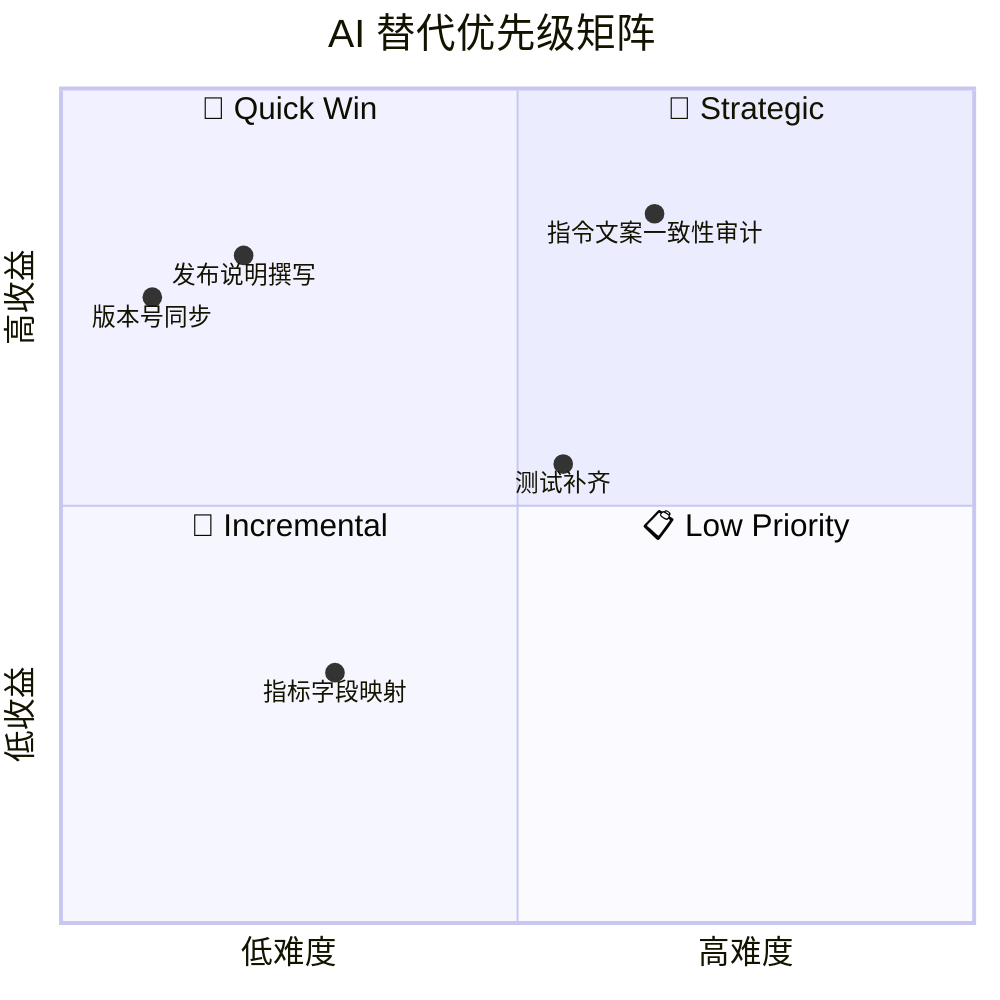

# zcode-tps-monitor — AI 工作流替代方案报告

**分析时间**：2026-09-29_164007
**分析范围**：`D:\Guiyuan1111\GitHub\zcode-tps-monitor`

---

## 0. 前置结论：运行时代码不宜 AI 替代

本项目运行时路径（`token-rate.mjs` 统计、`collect-core.mjs` 采集、MCP 帧解析）是**毫秒级、零依赖的确定性计算**，且以只读方式访问宿主数据库——用 AI 替代运行时执行只会引入不确定性、延迟与提示词漂移风险（v0.8.3 的教训恰恰证明：连「让模型转发一行统计」都需要精心设计的守卫与文案对齐）。因此本报告的替代对象是**开发与维护工作流**，而非运行时逻辑。值得注意的反向事实：插件已经把 AI（模型本身）作为运行时组件编排（收尾自测机制），这在同类工具中是先行设计。

---

## 1. 评估方法论

### 评分维度

| 维度 | 说明 | 低分（1-2） | 高分（4-5） |
|------|------|------------|------------|
| 确定性 | 输出是否可预测 | 高度创造性 | 完全确定性 |
| 输入结构化 | 输入是否边界清晰 | 模糊开放 | 严格结构化 |
| 安全风险 | 出错影响 | 灾难性 | 无影响 |
| 领域复杂度 | 所需专业程度 | 需要专家 | 通用知识 |
| 上下文需求 | 处理所需信息量 | 需整个代码库 | 局部即可 |
| 重复性 | 任务发生频率 | 一次性 | 高频重复 |

### 分级标准

| 等级 | 总分 | 策略 |
|------|------|------|
| 🤖 完全 AI 化 | 24-30 | AI 直接执行，无需人工介入 |
| 🧑‍💻 AI 辅助 | 15-23 | AI 生成初稿，人工审核后落地 |
| 👤 人工主导 | 6-14 | AI 仅提供参考，核心判断由人完成 |

---

## 2. 模块级评估

### 模块 1：版本号同步（version-sync）

**路径**：`marketplace.json:12`、`plugins/zcode-tps-monitor/.zcode-plugin/plugin.json:3`、`.claude-plugin/plugin.json:3`、`CHANGELOG.md`
**规模**：4 处文本编辑，每次发版必做

**6 维评分**：

| 确定性 | 输入结构化 | 安全风险 | 领域复杂度 | 上下文需求 | 重复性 | 总分 |
|--------|-----------|---------|-----------|-----------|-------|------|
| 5 | 5 | 4 | 5 | 5 | 5 | **29/30** |

**结论**：🤖 **完全 AI 化**

**当前人工做法**：发版时手工在 4 个文件里改同一版本号，并保证 CHANGELOG 日期/条目格式一致。

**AI 替代方式**：读取 git tag 或用户指定版本 → 定位 4 处 → 统一更新 → 输出 diff 供确认。校验点明确：MCP server 运行时从 `.zcode-plugin/plugin.json` 读版本（`tps-server.mjs:17-22`），漏改会造成市场显示与 MCP 握手版本漂移——这是当前流程唯一的静默出错面。

**预期收益**：消除 4 处不同步风险；发版前置耗时 ~5 分钟 → ~10 秒。
**风险与限制**：几乎无；仅需防拼写（语义化版本正则校验即可）。
**优先级**：⭐⭐⭐ **高** — Quick Win
**对应 Blueprint**：[blueprints/01-version-sync.md](blueprints/01-version-sync.md)

---

### 模块 2：发布说明撰写（release-notes-writer）

**路径**：`CHANGELOG.md` + GitHub Release 正文
**规模**：每次发版 1 篇（参照 0.8.3 条目约 20 行）

**6 维评分**：

| 确定性 | 输入结构化 | 安全风险 | 领域复杂度 | 上下文需求 | 重复性 | 总分 |
|--------|-----------|---------|-----------|-----------|-------|------|
| 4 | 4 | 5 | 4 | 3 | 4 | **24/30** |

**结论**：🤖 **完全 AI 化**（人工最后过目 10 秒）

**当前人工做法**：从 git log / diff 归纳「修复/新增/变更/测试」四段式 CHANGELOG；用户全局规范还要求 Release 描述「一个点一句话、精简专业、不强调测试过程」——这是高度格式化的写作任务。

**AI 替代方式**：输入 `git log <上版本>..HEAD` + diff 统计 → 按既有 8 个版本的文风（CHANGELOG 既是上下文又是风格样例）生成新条目 → 用户确认后落盘，并可联动 `gh release create`（附件按需打包插件目录）。

**预期收益**：撰写耗时 ~15 分钟 → ~1 分钟；文风与历史条目一致性提升。
**风险与限制**：需人工确认技术表述不失真（如「守卫」「口径」等本项目专有词不可误用）。
**优先级**：⭐⭐⭐ **高** — Quick Win
**对应 Blueprint**：[blueprints/02-release-notes-writer.md](blueprints/02-release-notes-writer.md)

---

### 模块 3：指令文案一致性审计（instruction-alignment-auditor）

**路径**：`hooks/session-start.mjs:30-35`、`hooks/prompt-submit.mjs:35-41`、`skills/zcode-tps-monitor/SKILL.md:30-33`、`README.md`（两份）、`CHANGELOG.md`
**规模**：6+ 个表面对同一机制（收尾自测）的描述

**6 维评分**：

| 确定性 | 输入结构化 | 安全风险 | 领域复杂度 | 上下文需求 | 重复性 | 总分 |
|--------|-----------|---------|-----------|-----------|-------|------|
| 3 | 4 | 5 | 3 | 2 | 3 | **20/30** |

**结论**：🧑‍💻 **AI 辅助**

**当前人工做法**：v0.8.3 整个版本（`CHANGELOG.md:3-20`、commit `60c0e19`）都在人工修复「各表面对收尾自测机制描述不一致」——SessionStart 欢迎语旧文案误导模型收尾时什么都不做、SKILL.md 旧要求让模型把「(上轮)」行贴给用户。**这是本项目历史上代价最高的一类缺陷，且必然复发**：每次机制微调都要同步 6+ 处自然语言。

**AI 替代方式**：建立「机制真源」（一份规范描述）→ AI 审计各表面文案与真源的偏差（禁语清单：「速率会自动显示」「原样附上注入行」；必语清单：守卫语义、纯问答不显示）→ 输出逐文件 diff 建议 → 人工定夺。触发时机：任何触及 hooks/SKILL/README 的改动后、发版前。

**预期收益**：把 v0.8.3 级别的返工从「用户反馈后整版修复」提前为「提交前 1 分钟审计」；这是对本项目核心质量风险（模型行为漂移）的直接防御。
**风险与限制**：审计结论需人工裁决——文案的「正确版本」本身是设计决策，AI 只找分歧不裁对错。
**优先级**：⭐⭐⭐ **高** — Strategic（本项目特有价值最高的一项）
**对应 Blueprint**：[blueprints/03-instruction-alignment-auditor.md](blueprints/03-instruction-alignment-auditor.md)

---

### 模块 4：测试补齐（test-backfill）

**路径**：目标文件 `scripts/lib/collect-core.mjs`（200 行，0 测试）、`mcp/tps-server.mjs`（152 行，0 测试）、`hooks/*.mjs`（3 文件，0 测试）
**规模**：约 400 行无覆盖逻辑

**6 维评分**：

| 确定性 | 输入结构化 | 安全风险 | 领域复杂度 | 上下文需求 | 重复性 | 总分 |
|--------|-----------|---------|-----------|-----------|-------|------|
| 4 | 4 | 5 | 3 | 3 | 3 | **22/30** |

**结论**：🧑‍💻 **AI 辅助**

**当前缺口**（见工作流报告 §2）：`deepFind` 三层匹配边界、demo clamp 区间、remote→demo 降级与 mode 标注、`watch` 统计口径、MCP `Content-Length` 半包/粘包切帧、`resolveUrl` 占位符、钩子输出的 JSON 合法性——全部零测试。既有 `test/token-rate.test.mjs` 的夹具模式（临时 SQLite + env 注入 + HOME 重定向）是现成的可复用范式。

**AI 替代方式**：AI 按既有夹具风格生成用例（它有 200 行样例可模仿）→ 跑 `node --test` 自验 → 人工 review 断言意图。MCP 帧解析可用子进程 stdin/stdout 管道做冒烟测试（README 已有手工冒烟命令可自动化，`plugins/zcode-tps-monitor/README.md:70-75`）。

**预期收益**：覆盖缺口模块；回归防御（v0.7.0 的「注入行弄丢」级缺陷将再难漏网）。
**风险与限制**：AI 易写「重实现式断言」（用与实现相同的公式算期望值，测不出错）——需人工把关期望值必须手写。
**优先级**：⭐⭐ **中高** — Strategic
**对应 Blueprint**：[blueprints/04-test-backfill.md](blueprints/04-test-backfill.md)

---

### 模块 5：doctor 诊断解读（tps-doctor-diagnose）

**路径**：`scripts/doctor.mjs` + `commands/tps-doctor.md`

**6 维评分**：

| 确定性 | 输入结构化 | 安全风险 | 领域复杂度 | 上下文需求 | 重复性 | 总分 |
|--------|-----------|---------|-----------|-----------|-------|------|
| 4 | 5 | 4 | 4 | 5 | 3 | **25/30** |

**结论**：🤖 **完全 AI 化——且已实现**。`commands/tps-doctor.md` 就是 shipped 的 AI 工作流：`doctor.mjs --json` 输出结构化结果（`doctor.mjs:163-164`），命令 prompt 指导模型逐项解读并按 hint 给建议（`commands/tps-doctor.md:7-15`）。此模块是「AI 替代人工排障」在本项目的成功先例，无需 Blueprint，列为其他模块的设计参照（结构化输出 + hint 字段 + 命令 prompt 三件套）。

---

### 模块 6：指标字段映射适配（metrics-field-mapper）

**路径**：`scripts/lib/collect-core.mjs:38-52`（TPS_KEYS/LAT_KEYS/ERR_KEYS + deepFind）

**6 维评分**：

| 确定性 | 输入结构化 | 安全风险 | 领域复杂度 | 上下文需求 | 重复性 | 总分 |
|--------|-----------|---------|-----------|-----------|-------|------|
| 3 | 3 | 5 | 3 | 4 | 2 | **20/30** |

**结论**：🧑‍💻 **AI 辅助**（低优先级）。用户的指标 JSON 若超出内置字段词表（三层深度内找不到），需要改 `collect-core.mjs:38-40` 的键清单。AI 可根据用户提供的真实 JSON 样本生成键映射补丁。发生频率低（配置一次），列入 Incremental，暂不产出 Blueprint。

---

### 不适用 AI 替代的模块（诚实声明）

| 模块 | 理由 |
|------|------|
| `token-rate.mjs` 统计核心 | 确定性毫秒级计算 + 只读库访问；AI 化无收益、有漂移风险 |
| `generate-icon.mjs` SDF 参数调优 | 纯视觉判断，模型不可见（文字模型限制），只能人工看图迭代（git 史上 5 个 icon fix commit 印证） |
| `overlay.ps1` Win32 细节 | 强平台经验依赖 + 无自动化验证手段，AI 建议仅作参考 |

---

## 3. ROI 优先级矩阵

| 工作流 | 评分 | 等级 | 实施难度 | 预期收益 | 优先级 | 阶段 |
|--------|------|------|---------|---------|--------|------|
| 版本号同步 | 29/30 | 🤖 完全 AI 化 | 低 | 高 | 🥇 | Phase 1 |
| 发布说明撰写 | 24/30 | 🤖 完全 AI 化 | 低 | 高 | 🥇 | Phase 1 |
| 指令文案一致性审计 | 20/30 | 🧑‍💻 AI 辅助 | 中 | 高 | 🥈 | Phase 2 |
| 测试补齐 | 22/30 | 🧑‍💻 AI 辅助 | 中 | 中 | 🥈 | Phase 2 |
| 指标字段映射 | 20/30 | 🧑‍💻 AI 辅助 | 低 | 低 | 🥉 | Phase 3 |
| doctor 诊断解读 | 25/30 | 🤖（已实现） | — | — | ✅ 已落地 | — |

---

## 4. AI 改造路线图

### Phase 1 — Quick Wins（本月）

| 工作流 | 措施 | 预期效果 | 依据 |
|--------|------|---------|------|
| 版本号同步 | 按 [blueprints/01](blueprints/01-version-sync.md) 建技能 | 发版前置 5min → 10s，消除 4 处漂移 | 29/30 |
| 发布说明撰写 | 按 [blueprints/02](blueprints/02-release-notes-writer.md) 建技能（可联动 gh release） | CHANGELOG/Release 撰写 15min → 1min | 24/30 |

### Phase 2 — Strategic（本季度）

| 工作流 | 措施 | 预期效果 | 依据 |
|--------|------|---------|------|
| 指令文案一致性审计 | 按 [blueprints/03](blueprints/03-instruction-alignment-auditor.md) 建审计技能，发版前必跑 | v0.8.3 级返工提前拦截 | 20/30，独特高风险面 |
| 测试补齐 | 按 [blueprints/04](blueprints/04-test-backfill.md) 补 collect-core/MCP 用例 | 覆盖 ~400 行无测试逻辑 | 22/30 |

### Phase 3 — Incremental（择机）

| 工作流 | 措施 | 预期效果 |
|--------|------|---------|
| 指标字段映射 | 用户带 JSON 样本咨询时由 AI 生成键映射补丁 | 降低自定义接入门槛 |

---

## 5. 实施前提与建议

### 前提条件

- [x] 项目零依赖、模块小——AI 所需上下文可完整装入（两个核心库各 200/293 行）
- [x] 已有高质量「参照实现」：doctor 三件套（结构化 JSON + hint + 命令 prompt）与 test 夹具范式
- [ ] 建议先落一份「机制真源」文档（收尾自测的规范描述），作为文案审计的基准——目前真源散在 README 工作原理一节

### 开始建议

1. **从 blueprints/01 试水**：纯机械、零风险、当次发版即可受益。
2. **文案审计（03）值得优先于测试（04）**：本项目缺陷史的众数是文案/指令漂移而非代码逻辑错误，防御投入应按历史风险分布。
3. **所有技能遵循 doctor 三件套模式**：脚本输出结构化 JSON、hint 内嵌修复建议、技能只做解读与编排——这是本项目已验证的 AI 协作范式。

---

## 附录：评分明细

| 工作流 | 确定性 | 输入结构化 | 安全风险 | 领域复杂度 | 上下文需求 | 重复性 | 总分 |
|--------|--------|-----------|---------|-----------|-----------|-------|------|
| 版本号同步 | 5 | 5 | 4 | 5 | 5 | 5 | 29 |
| 发布说明撰写 | 4 | 4 | 5 | 4 | 3 | 4 | 24 |
| 指令文案一致性审计 | 3 | 4 | 5 | 3 | 2 | 3 | 20 |
| 测试补齐 | 4 | 4 | 5 | 3 | 3 | 3 | 22 |
| 指标字段映射 | 3 | 3 | 5 | 3 | 4 | 2 | 20 |
| doctor 诊断解读 | 4 | 5 | 4 | 4 | 5 | 3 | 25 |
